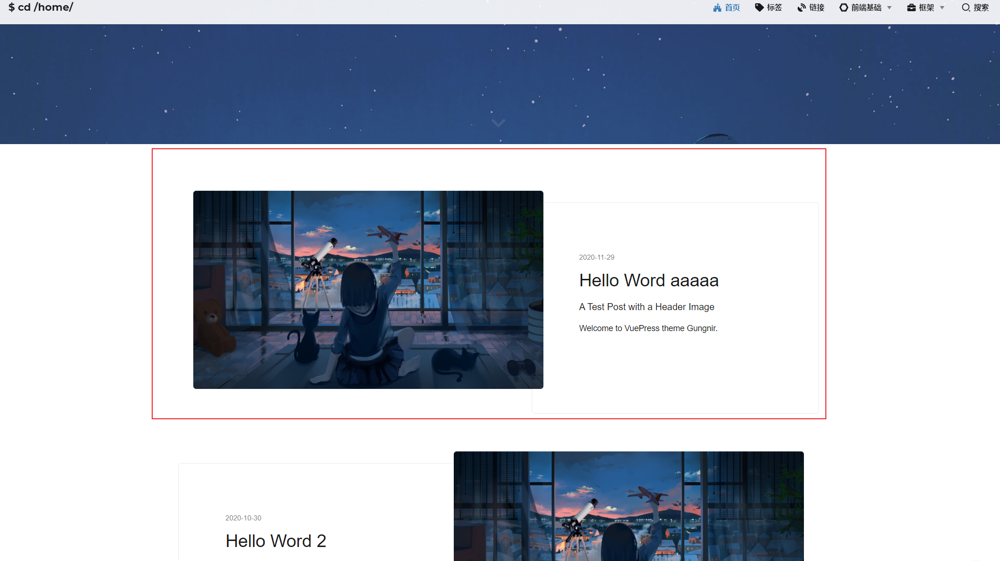
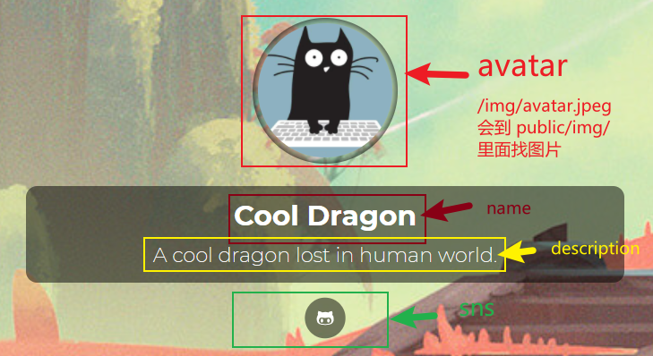
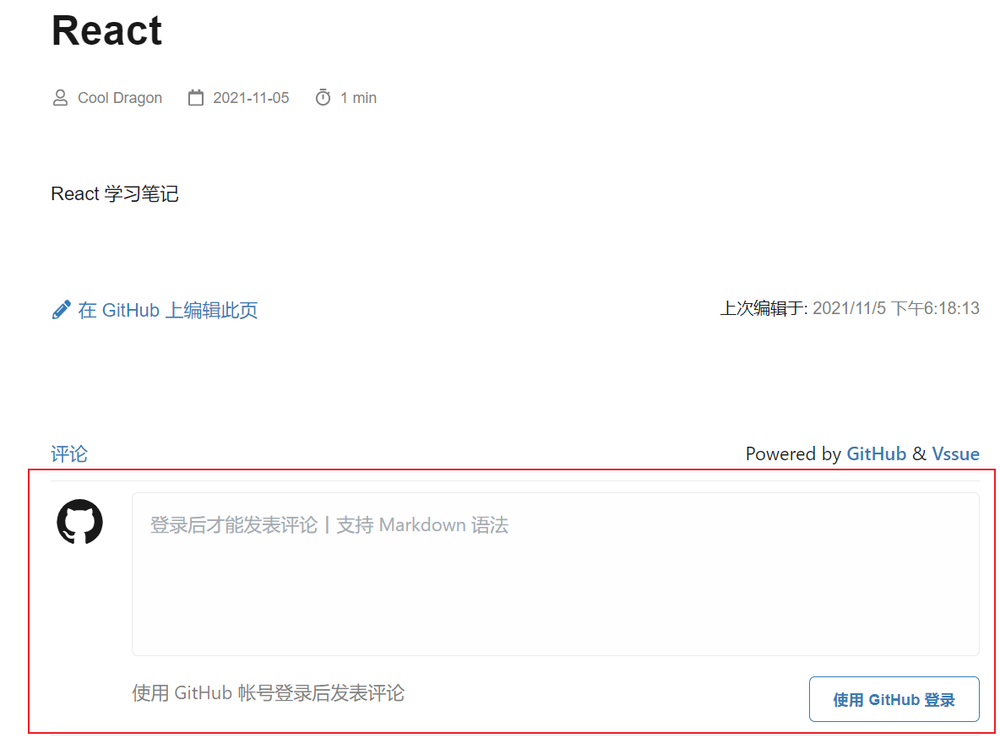
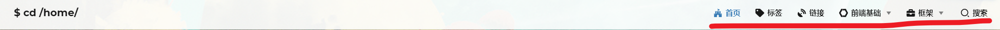
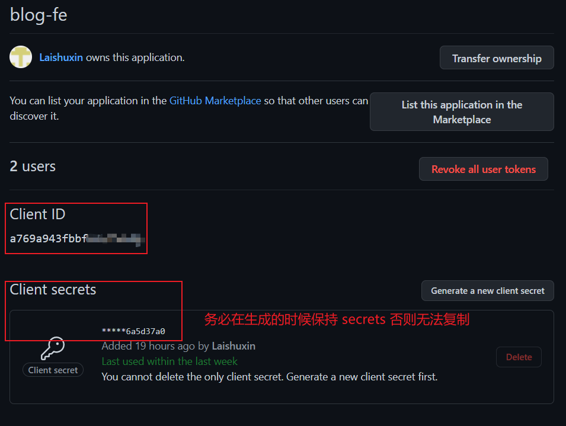

# Gungnir

[](https://www.npmjs.com/package/vuepress-theme-gungnir) [](https://vuepress-theme-gungnir.vercel.app/docs/) [](LICENSE)

一个基于 [VuePress](https://vuepress.vuejs.org/) 的博客主题。同时[这里](https://github.com/Renovamen/jekyll-theme-gungnir)还有一个它的 [Jekyll](https://jekyllrb.com/) 版本。

**Gungnir**，冈格尼尔，北欧神话中主神奥丁使用的用世界树树枝做成的武器，和本主题没有半毛钱关系但我就是用了这个名字。

🇬🇧 [English Intro](README.md) | 🇨🇳 中文说明


&nbsp;

## 特性

- 简洁美观（反正这点我说是就是了）
- 响应式
- 多级目录
- 可切换的首页大图
- 明亮和夜间模式：识别系统的外观设置并自动切换模式，也支持用户手动切换
- 搜索
- 文章目录
- 多种代码高亮主题，支持代码块全屏（从 WordPress 主题 [Sakura](https://github.com/mashirozx/Sakura) 搬过来的功能）
- 基于 [Katex](https://github.com/KaTeX/KaTeX) 的公式支持
- 在文章中使用图表：[Chart.js](https://www.chartjs.org)、[Mermaid](https://mermaid-js.github.io)、[roughViz.js](https://github.com/jwilber/roughViz) 和 [markmap](https://github.com/gera2ld/markmap)
- 一些 Markdown 增强样式，目前支持：
  - 脚注（基于 [markdown-it-footnote](https://github.com/markdown-it/markdown-it-footnote)）
  - 高亮（基于 [markdown-it-mark](https://github.com/markdown-it/markdown-it-mark)）
- 站点统计（[Google Analytics](https://analytics.google.com/) 和 [百度统计](https://tongji.baidu.com/)）
- 评论（基于 [Vssue](https://github.com/meteorlxy/vssue)）
- RSS
- 阅读时间估计
- 多语言支持（英文、简体中文）
- 带标签的归档页、链接页

&nbsp;

## 演示站点

这里有一些演示站点：

- [vuepress-theme-gungnir.vercel.app](https://vuepress-theme-gungnir.vercel.app/)
- [zxh.io](https://zxh.io)（我的博客）

&nbsp;

## 文档

[这里](https://vuepress-theme-gungnir.vercel.app/docs/)是本主题的文档。

&nbsp;

## 使用

### Quick Start

```sh
# 安装依赖
npm install
# or
yarn

# 编译
npm run dev
# or
yarn dev

# 部署
# 注意:
# - 需要在 shell 环境，可以使用 git bash。
# - 在 vscode 终端 和 windows cmd 执行不了。
# - 部署之前需要修改 scripts/deploy.sh 文件中的 git push 仓库指向。
npm run deploy
# or
yarn deploy

# 格式化
npm run format
# or
yarn format
```

### 文件结构说明

核心文件存放在 `blog` 文件夹中。

- `blog/.vuepress`：这是里面的配置文件。
- `blog/framework`：分类页面，等下配置 `nav` 会讲。
- `blog/frontend`：分类页面，等下配置 `nav` 会讲。
- `blog/links`：分类页面，等下配置 `nav` 会讲。
- `blog/post`：首页下面的文章。
  
- `blog/.vuepress/public/img/*`: 所以以 `/img/*` 的图片最后会指向该文件中的图片。
- `blog/.vuepress/configs/*`: 存放页面相关的配置文件。

### 配置

#### 基本的配置

基本的配置存放在 `./vuepress/config.js`。

l. title: 会在首页页面标签出显示。


2. author: 最终会插入到 footer 等地方。
3. personalInfo。
   
4. comment。
   

- owner: 你 GitHub 的用户名。
- repo: 你 GitHub 的仓库名（建议 fork 该仓库，然后去修改，默认为 `'blog-fe'`）。
- clientId / clientSecret: 需要你在 GitHub 生成（可参考[附录](#create)）后进行配置。

5. plugins: 用于控制插件的打开与关闭。默认全部打开，但是开的越多，编译速度越慢。插件的功能可以参考 [Plugins](https://vuepress-theme-gungnir.vercel.app/docs/plugins/)。插件的使用可以参考 `blog/posts/hello-world-1.md` 和 `blog/posts/hello-world-2.md` 两个模板文章。

#### 导航栏

导航栏的配置放在 `blog/.vuepress/configs/nav.js` 中，注意配置时候的路径。配置完成可以生成如下的导航栏：


更多导航栏的配置可以参考：

- [Default Theme Config](https://vuepress.vuejs.org/theme/default-theme-config.html#homepage)

#### 侧边栏

侧边栏的配置放在 `blog/.vuepress/configs/sidebar.js`，配置的时候需要注意路径问题。为了方便使用，里面内置了一个 `getChildren` 函数，用于提取 `.md` 文件，并生成对应的配置。

使用方式如下。例如我们要生成一个 `frontend` 的大类，然后里面又有 HTML, CSS, JavaScript 的小类。

1. 创建文件夹。在 `blog` 文件夹下创建一个 `frontend` 的文件夹。
2. 创建子类文件夹。在 `blog/frontend/` 下分别创建 html, css, javascript 三个文件夹。
3. 创建索引文件。分别在 `blog/frontend/`, `blog/frontend/html`, `blog/frontend/css`, `blog/frontend/javascript` 下创建 `README.md` 文件。因为 vuepress 在路由跳转的时候，默认会去找当前路由下的 `README.md` 文件，作为 `index.html`。
4. 在 `blog/.vuepress/configs/sidebar` 中进行配置。

关于 `getChildren` 的使用：

1. `getChildren` 会提取指定目录（默认以 `blog/` 作为 base 目录）下的 `.md` 文件，并生成 sidebar 中 children 的配置。

2. 如果需要指定文章的优先级，可以通过在文件末尾设置优先级。
   例如：`a.md`, `c-1.md`, `b-2.md`。会以 `-` 后面的数字作为排序规则，如果没有提供优先级，默认以字母表的形式排序。执行 `getChildren` 会生成 `['a', 'c-1', 'b-2']`

`getChildren` 源码在 `blog/.vuepress/utils.js` 中，实现也非常简单，有兴趣的同学可以去看一下。

更多 sidebar 的配置可以参考：

- [Sidebar](https://vuepress.vuejs.org/theme/default-theme-config.html#sidebar)

### 文章的编写

1. 配置。使用 Snippets(下面有相应的 snippets) 快速生成配置 `header`。其中 `title` 是必须了，有了 title 字段就不能在 markdown 文件中使用一级标题(`# h1`)。
2. 内容编写。支持任何 Markdown 语法，同时 [VuePress](https://vuepress.vuejs.org/) 官方也提供了一些强化语法。

==注意==:
1. 如果修改了配置文件，或者是 `.md` 文件的配置，都需要重新编译才能生效。
2. markdown 中的图片不需要放在 `blog/.vuepress/public` 文件下。

### Snippets

为了方便编写文章，下面提供了一些实用的 snippets。

使用步骤：

1. 在 `settings` 中选择 `User Snippets`，选择 `markdown.json`。（如果不存在则需要自行创建）
2. 可以根据对应的 `prefix` 快速生成代码模板。

````json
{
  "bold": {
    "prefix": "bold",
    "body": "**$1**$0"
  },
  "highline": {
    "prefix": "highline",
    "body": "==$1==$0"
  },
  "reference": {
    "prefix": "reference",
    "body": "[^$0]"
  },
  "code": {
    "prefix": "code",
    "body": "`$1`$0"
  },
  "code:json": {
    "prefix": "code:json",
    "body": ["```json", "$0", "```"]
  },
  "code:javascript": {
    "prefix": "code:javascript",
    "body": ["```javascript", "$0", "```"]
  },
  "code:typescript": {
    "prefix": "code:typescript",
    "body": ["```typescript", "$0", "```"]
  },
  "code:jsx": {
    "prefix": "code:jsx",
    "body": ["```jsx", "$0", "```"]
  },
  "code:tsx": {
    "prefix": "code:tsx",
    "body": ["```tsx", "$0", "```"]
  },
  "code:css": {
    "prefix": "code:css",
    "body": ["```css", "$0", "```"]
  },
  "code:html": {
    "prefix": "code:html",
    "body": ["```css", "$0", "```"]
  },
  "container:info": {
    "prefix": "container:info",
    "body": ["::: info", "$0", ":::"]
  },
  "container:tip": {
    "prefix": "container:tip",
    "body": ["::: tip", "$0", ":::"]
  },
  "container:warning": {
    "prefix": "container:warning",
    "body": ["::: warning", "$0", ":::"]
  },
  "container:danger": {
    "prefix": "container:danger",
    "body": ["::: danger", "$0", ":::"]
  },
  "config:fe": {
    "prefix": "config:fe",
    "body": [
      "---",
      "title: 前端 - $1 # 博客标题（必须）",
      "subtitle: $2 # 博客副标题（可选）",
      "date: $CURRENT_YEAR-$CURRENT_MONTH-$CURRENT_DATE",
      "header_style: image # 是否在博客中显示封面图：`image`（显示） / `text`（不显示）（可选，默认为 `text`）",
      "header_img: /img/home-bg/1.jpg # 博客封面图（必须，即使上一项选了 `text`，图片也需要在首页显示）",
      "header_mask: rgba(40, 57, 101, .4) # 封面图遮罩（可选）",
      "catalog: true # 是否启用右侧目录：false / true（可选，默认为 false）",
      "tags: # 博客标签",
      "  - $3",
      "---",
      "",
      "$0"
    ]
  },
  "config:fe-javascript": {
    "prefix": "config:fe-javascript",
    "body": [
      "---",
      "title: JavaScript - $1 # 博客标题（必须）",
      "subtitle: $2 # 博客副标题（可选）",
      "date: $CURRENT_YEAR-$CURRENT_MONTH-$CURRENT_DATE",
      "header_style: image # 是否在博客中显示封面图：`image`（显示） / `text`（不显示）（可选，默认为 `text`）",
      "header_img: /img/home-bg/1.jpg # 博客封面图（必须，即使上一项选了 `text`，图片也需要在首页显示）",
      "header_mask: rgba(40, 57, 101, .4) # 封面图遮罩（可选）",
      "catalog: true # 是否启用右侧目录：false / true（可选，默认为 false）",
      "tags: # 博客标签",
      "  - $3",
      "---",
      "",
      "$0"
    ]
  },
  "config:fe-html": {
    "prefix": "config:fe-html",
    "body": [
      "---",
      "title: HTML - $1 # 博客标题（必须）",
      "subtitle: $2 # 博客副标题（可选）",
      "date: $CURRENT_YEAR-$CURRENT_MONTH-$CURRENT_DATE",
      "header_style: image # 是否在博客中显示封面图：`image`（显示） / `text`（不显示）（可选，默认为 `text`）",
      "header_img: /img/home-bg/1.jpg # 博客封面图（必须，即使上一项选了 `text`，图片也需要在首页显示）",
      "header_mask: rgba(40, 57, 101, .4) # 封面图遮罩（可选）",
      "catalog: true # 是否启用右侧目录：false / true（可选，默认为 false）",
      "tags: # 博客标签",
      "  - $3",
      "---",
      "",
      "$0"
    ]
  },
  "config:fe-css": {
    "prefix": "config:fe-css",
    "body": [
      "---",
      "title: CSS - $1 # 博客标题（必须）",
      "subtitle: $2 # 博客副标题（可选）",
      "date: $CURRENT_YEAR-$CURRENT_MONTH-$CURRENT_DATE",
      "header_style: image # 是否在博客中显示封面图：`image`（显示） / `text`（不显示）（可选，默认为 `text`）",
      "header_img: /img/home-bg/1.jpg # 博客封面图（必须，即使上一项选了 `text`，图片也需要在首页显示）",
      "header_mask: rgba(40, 57, 101, .4) # 封面图遮罩（可选）",
      "catalog: true # 是否启用右侧目录：false / true（可选，默认为 false）",
      "tags: # 博客标签",
      "  - $3",
      "---",
      "",
      "$0"
    ]
  },
  "config:framework": {
    "prefix": "config:framework",
    "body": [
      "---",
      "title: 框架 - $1 # 博客标题（必须）",
      "subtitle: $2 # 博客副标题（可选）",
      "date: $CURRENT_YEAR-$CURRENT_MONTH-$CURRENT_DATE",
      "header_style: image # 是否在博客中显示封面图：`image`（显示） / `text`（不显示）（可选，默认为 `text`）",
      "header_img: /img/home-bg/1.jpg # 博客封面图（必须，即使上一项选了 `text`，图片也需要在首页显示）",
      "header_mask: rgba(40, 57, 101, .4) # 封面图遮罩（可选）",
      "catalog: true # 是否启用右侧目录：false / true（可选，默认为 false）",
      "tags: # 博客标签",
      "  - $3",
      "---",
      "",
      "$0"
    ]
  },
  "config:framework-react": {
    "prefix": "config:framework-react",
    "body": [
      "---",
      "title: React - $1 # 博客标题（必须）",
      "subtitle: $2 # 博客副标题（可选）",
      "date: $CURRENT_YEAR-$CURRENT_MONTH-$CURRENT_DATE",
      "header_style: image # 是否在博客中显示封面图：`image`（显示） / `text`（不显示）（可选，默认为 `text`）",
      "header_img: /img/home-bg/1.jpg # 博客封面图（必须，即使上一项选了 `text`，图片也需要在首页显示）",
      "header_mask: rgba(40, 57, 101, .4) # 封面图遮罩（可选）",
      "catalog: true # 是否启用右侧目录：false / true（可选，默认为 false）",
      "tags: # 博客标签",
      "  - $3",
      "---",
      "",
      "$0"
    ]
  },
  "config:framework-vue": {
    "prefix": "config:framework-vue",
    "body": [
      "---",
      "title: Vue - $1 # 博客标题（必须）",
      "subtitle: $2 # 博客副标题（可选）",
      "date: $CURRENT_YEAR-$CURRENT_MONTH-$CURRENT_DATE",
      "header_style: image # 是否在博客中显示封面图：`image`（显示） / `text`（不显示）（可选，默认为 `text`）",
      "header_img: /img/home-bg/1.jpg # 博客封面图（必须，即使上一项选了 `text`，图片也需要在首页显示）",
      "header_mask: rgba(40, 57, 101, .4) # 封面图遮罩（可选）",
      "catalog: true # 是否启用右侧目录：false / true（可选，默认为 false）",
      "tags: # 博客标签",
      "  - $3",
      "---",
      "",
      "$0"
    ]
  }
}
````

## 更多配置

- [VuePress](https://vuepress.vuejs.org/)
- [Gungnir - Documentation](https://vuepress-theme-gungnir.vercel.app/docs/)

## FAQ

1. 针对 `prefix` 过长的问题。事实上 Vscode 运行输入部分 `prefix` 就可以帮我们推导出来。例如：`prefix = container:info`，只需要输入 `info` 就会有相应的代码提示。
2. 针对编译太慢的问题。这是由于 VuePress 采用 Webpack 进行编译，可能编译过程会比较慢。
3. 关于页面加载慢。页面初始化的时候会加载很多资源，可能会慢一点。
4. 关于预览问题。VuePress 支持热更新，但如果是新创建的文件或者修改了 `.md` 文件的 `config`，则需要重新编译。可以使用 Vscode 的一些插件进行预览，但其功能没有 VuePress 内置的 Markdown 解析器提供的完善。

## Appendix

### <span id="create">生成 clientId 和 clientSecret</span>

GitHub settings -> Developer settings -> OAuthe Apps -> new OAuth App。



## 开源协议

Gungnir 主题遵守 [Apache License 2.0](https://www.apache.org/licenses/LICENSE-2.0) 开源协议，详细细节见 [LICENSE](packages/theme-gungnir/LICENSE) 文件。
